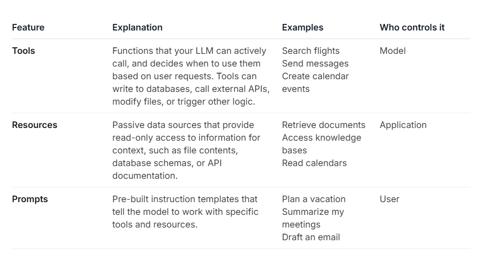

# User CRUD FastMCP Server

This is a FastMCP server that provides CRUD functionality for Users.

## Setup

1. Create a virtual environment:
   ```bash
   python -m venv venv
   ```

2. Activate the virtual environment:
   - Windows: `venv\Scripts\activate`
   - Unix/MacOS: `source venv/bin/activate`

3. Install fastmcp:
   ```bash
   pip install fastmcp
   ```

## Usage

Run the server in development mode with the MCP Inspector:

```bash
fastmcp dev user_crud_server.py
```

## Tools

- `create_user(name, email, role)`: Create a new user.
- `read_user(user_id)`: Get user details.
- `update_user(user_id, ...)`: Update user details.
- `delete_user(user_id)`: Delete a user.
- `result_users()`: List all users.

## Resources

- `users://list`: JSON list of all users.

## Prompts

- `onboard_user(name)`: A prompt to welcome new users and ask for their details.


## Configuration

A server configuration file `mcp.json` has been generated. You can use this to register the server with MCP clients (like Claude Desktop).


-----NOTES-----
